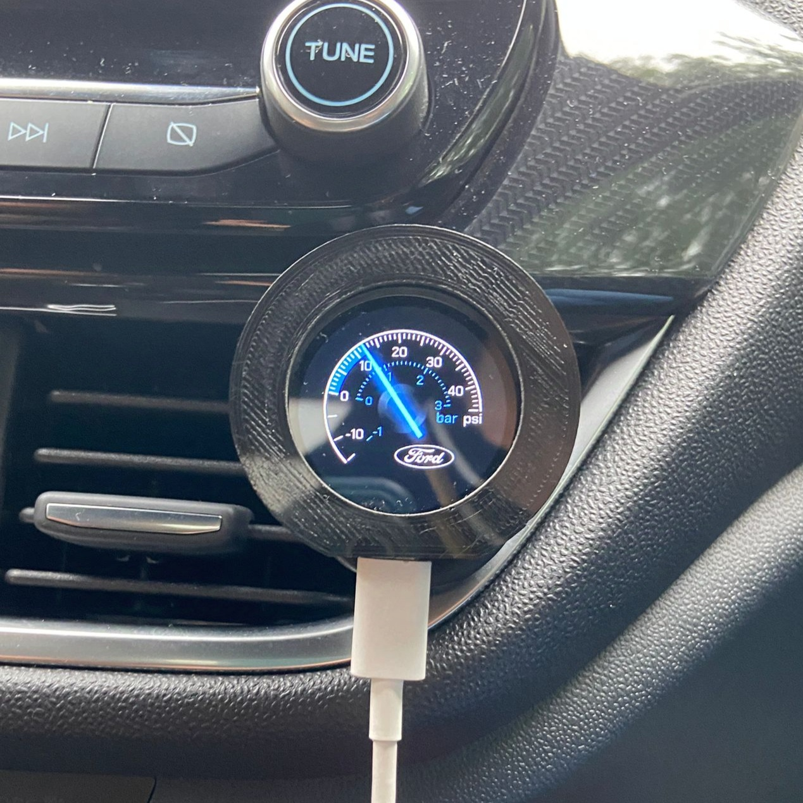

# OBD2 ELM327 Car Gauge
Boost pressure car gauge retrieving data from a bluetooth OBD2 and data are displayed on a ESP32-S3 touch display.

# Photo

## How it works

We are using Ble for connecting to the OBD2 (Server) and the esp32 act as client device.

## Arduino settings

## Links

- Display: [Aliexpress ESP32 Display](https://it.aliexpress.com/item/1005006169531322.html?spm=a2g0o.order_list.order_list_main.77.34513696xiTFVr&gatewayAdapt=glo2ita)
- OBD2: [Aliexpress OBD2](https://it.aliexpress.com/item/32951258002.html?spm=a2g0o.order_list.order_list_main.169.34513696xiTFVr&gatewayAdapt=glo2ita)
